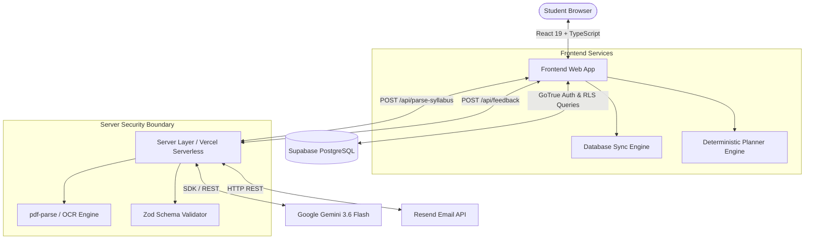

# PACE — Personalized Academic Planning & Execution

> **Know what to study. Every day.**

PACE is a production-oriented, full-stack academic planning platform designed for students preparing for high-stakes examinations (Class 11, Class 12, JEE Main & Advanced, NEET UG, GATE CS, and Commerce). 

The application transforms complex syllabi, exam target dates, weekly timetable constraints, and real-time study logs into an actionable, adaptive, and balanced daily study schedule.

---

## 📋 Executive Summary

```
                      ┌────────────────────────────────────────────────────────┐
                      │                 INPUT CONSTRAINTS                      │
                      │  • Syllabus (PDF / Image / Text / Starter Templates)   │
                      │  • Target Exam Deadline Date                           │
                      │  • Daily Available Study Hours                         │
                      │  • Weekly Timetable Commitments (School/Coaching)     │
                      └───────────────────────────┬────────────────────────────┘
                                                  │
                                                  ▼
                      ┌────────────────────────────────────────────────────────┐
                      │              STUDY PLANNER SYSTEM (PACE)               │
                      │  1. Unstructured AI Extraction (Gemini 3.6 + Zod)      │
                      │  2. Student Structure Review & Approval                │
                      │  3. Rule-Based Deterministic Scheduling Engine         │
                      │  4. Focus Timer, Spaced Revision & Analytics           │
                      │  5. Real-Time Adaptive Redistribution                │
                      └───────────────────────────┬────────────────────────────┘
                                                  │
                                                  ▼
                      ┌────────────────────────────────────────────────────────┐
                      │                    STUDENT OUTPUT                      │
                      │  "Today's Balanced Daily Study Checklist & Timetable"  │
                      └────────────────────────────────────────────────────────┘
```

---

## 🎯 Problem Statement

Students preparing for competitive examinations face three primary execution bottlenecks:
1. **Curriculum Overload**: Syllabi consist of hundreds of chapters and subtopics across multiple subjects. Students struggle to break them down into manageable daily units.
2. **Static Timetable Failure**: Traditional rigid timetables break down after the first missed day or unexpected school commitment, causing student panic and study abandonment.
3. **Planning Overhead & Decision Fatigue**: Students waste hours calculating *what* to study next instead of executing study sessions.

**PACE addresses these issues by decoupling curriculum parsing from daily scheduling**: AI is used strictly to parse and structure ambiguous syllabus documents, while a rule-based deterministic algorithm calculates and dynamically adjusts the daily study queue.

---

## 💡 Core Philosophy

### *Simple on the outside. Smart underneath.*

- **Student UX**: Clean, distraction-free, serif-accented dashboard featuring today's tasks, a Pomodoro/flexible focus timer, revision alerts, and social accountability.
- **Engine Layer**: Manages hierarchical data modeling, multi-constraint schedule optimization, spaced-repetition timing, Supabase RLS security, and real-time database synchronization.

---

## 🏛️ System Architecture



---

## ⚙️ Key Engineering Decision: AI vs. Deterministic Logic

A foundational architectural decision in PACE is **restricting AI to tasks involving natural language ambiguity while using deterministic code for schedule generation**.

```
┌─────────────────────────────────────────────────┐   ┌─────────────────────────────────────────────────┐
│     UNSTRUCTURED AMBIGUITY (AI BOUNDARY)        │   │     DETERMINISTIC PREDICTABILITY (ENGINE)     │
├─────────────────────────────────────────────────┤   ├─────────────────────────────────────────────────┤
│ Input: Messy PDF scans, text copy-pastes        │   │ Input: Structured JSON + Exam Date + Constraints│
│ Function: Entity extraction & normalization     │   │ Function: Mathematical workload allocation      │
│ Model: Gemini 3.6 Flash + Zod Validation        │   │ Implementation: Rule-Based Scheduling Algorithm │
└─────────────────────────────────────────────────┘   └─────────────────────────────────────────────────┘
```

### Technical Trade-Off Rationale:
- **0% Hallucination in Scheduling**: Large Language Models fail at strict temporal and numeric calculations (e.g., distributing 180 chapters across 142 days while respecting 3-hour Monday commitments). A deterministic engine guarantees 100% mathematical accuracy.
- **Cost & Latency Optimization**: AI is invoked **only once** when a user imports an unstructured document. Once saved in Supabase, all daily schedule updates run locally and serverlessly with zero API cost and sub-5ms latency.
- **Testability**: The scheduling engine is covered by deterministic unit tests (`npm test`) that verify exact edge-case behavior (e.g., exam proximity, missed days, spaced revisions).

---

## 🤖 AI Syllabus Pipeline — Deep Dive

The syllabus ingestion pipeline accepts PDF documents, image scans, or raw text and outputs a validated hierarchical curriculum:

```
[Raw Document / Text] 
         │
         ▼
[Text Extraction / pdf-parse] ──(Server-Side)
         │
         ▼
[Gemini 3.6 Flash API Call] ──(Structured JSON Prompt)
         │
         ▼
[Zod Schema Validation] ─────(Rejects Invalid Structures)
         │
         ▼
[Interactive Student Review] ──(Client Approval Gate)
         │
         ▼
[Supabase PostgreSQL Save] ──(Row Level Security Protected)
```

### Pipeline Guarantees:
1. **Server-Side Key Isolation**: All Gemini API calls execute in isolated server endpoints (`/api/parse-syllabus`). `GEMINI_API_KEY` is never exposed in the browser client bundle.
2. **Strict Zod Schema Enforcement**: Output is validated against a Zod schema (`SubjectSchema` & `ChapterSchema`). If validation fails, an explicit error is returned—the system **never** silently injects fallback demo data.
3. **Human-in-the-Loop Review**: Before committing AI-extracted curricula to the database, the student is presented with an editable tree view to inspect, rename, or re-order subjects and chapters.

---

## 🧮 Deterministic Planner Engine — Deep Dive

The scheduling engine ([src/services/plannerEngine.ts](file:///c:/Users/mujah/Desktop/Projects/study%20planner/src/services/plannerEngine.ts)) operates as a multi-stage heuristic pipeline:

### 1. Workload Computation
- **Total Workload ($W$)**: $\sum (\text{Chapter Estimated Minutes} \times \text{Difficulty Weight})$
  - Difficulty Weights: `easy` = 1.0, `medium` = 1.25, `hard` = 1.5.
- **Available Days ($D$)**: $\text{Target Exam Date} - \text{Current Date}$.

### 2. Constraint-Aware Daily Allocation
- **Timetable Adjustment**: Subtracts recurring weekly commitments (e.g., school/coaching hours) from standard daily target hours to derive net available study minutes per day.
- **Exam Proximity Status**:
  - `On Track`: Workload fits comfortably within target exam timeline.
  - `Needs Focus`: Workload density requires increased daily study output.
  - `Behind`: Exam date is critically close relative to unstudied chapters.

### 3. Spaced Revision Interval Algorithm
- Completed chapters trigger automatic spaced-repetition revision items:
  - **1st Revision**: 1 day after initial completion.
  - **2nd Revision**: 7 days after initial completion.
  - **3rd Revision**: 30 days after initial completion.

---

## 🔄 Adaptive Scheduling Mechanics

The system adapts to real-world student execution without manual schedule rebuilds:

- **Missed Work Handling**: Unfinished tasks from yesterday are automatically redistributed into future available days based on net daily capacity, avoiding double-booking next-day schedules.
- **Early Completion**: Marking chapters completed immediately reduces total remaining workload ($W$) and recalculates daily requirements across remaining subjects.
- **Session Feedback Integration**: Logging post-study difficulty (`easy`, `okay`, `hard`) adjusts chapter review flags and prioritizes difficult topics in subsequent study queues.

---

## 🗄️ Database Schema & Relational Data Model

The PostgreSQL schema is structured around student isolation and social circle boundaries:

```
[auth.users] (Supabase Auth)
     │
     ├── 1:1 ── [public.profiles] (Name, Email, Streak, Weekly Minutes, Privacy Settings)
     │
     ├── 1:N ── [public.exams] (Target Exam Name, Target Date, Color)
     │            │
     │            └── 1:N ── [public.subjects]
     │                         └── 1:N ── [public.chapters]
     │                                      └── 1:N ── [public.subtopics]
     │
     ├── 1:N ── [public.study_sessions] (Completed Sessions, Duration, Feedback, Notes)
     ├── 1:N ── [public.timetable_events] (Weekly Recurring Commitments)
     ├── 1:N ── [public.notifications] (In-App Alerts & Social Nudges)
     ├── 1:N ── [public.feedback_reports] (In-App Feedback & Issue Log)
     │
     └── 1:N ── [public.friend_requests] ──> [public.friendships] (Reciprocal Bonds)
```

---

## 🔒 Authentication, Security & Row Level Security (RLS)

### Authentication Flow
- **Supabase GoTrue Auth**: Email/password authentication with mandatory email verification redirect (`/auth/callback`).
- **Protected Client Routes**: Unauthenticated users are redirected to auth modals before accessing planner screens.

### Row Level Security (RLS) Policies
Every table in `public` has Row Level Security enabled:

```sql
-- Example RLS Policy from init_schema.sql
ALTER TABLE public.subjects ENABLE ROW LEVEL SECURITY;

CREATE POLICY "Users can manage own subjects"
  ON public.subjects FOR ALL
  USING (auth.uid() = user_id)
  WITH CHECK (auth.uid() = user_id);
```

### Social Privacy Isolation:
- **Friend Isolation**: Connected study buddies can **only** view a friend's display name, avatar, day streak, and total weekly hours. Private syllabi, notes, chapters, and tasks remain strictly isolated by RLS policies (`auth.uid() = user_id`).

---

## 🛠️ Backend API Endpoints & Server Functions

| Method | Endpoint | Handler File | Function & Description |
| :--- | :--- | :--- | :--- |
| `POST` | `/api/parse-syllabus` | [api/parse-syllabus.ts](file:///c:/Users/mujah/Desktop/Projects/study%20planner/api/parse-syllabus.ts) | Extracts text from PDF/image/text & validates structured JSON via Gemini 3.6 + Zod. |
| `POST` | `/api/feedback` | [api/feedback.ts](file:///c:/Users/mujah/Desktop/Projects/study%20planner/api/feedback.ts) | Stores submissions in `public.feedback_reports` & delivers HTML emails via Resend API. |
| `POST` | `/api/smart-insights` | [api/smart-insights.ts](file:///c:/Users/mujah/Desktop/Projects/study%20planner/api/smart-insights.ts) | Generates personalized study performance tips based on recent completion history. |
| `GET` | `/api/health` | [api/health.ts](file:///c:/Users/mujah/Desktop/Projects/study%20planner/api/health.ts) | Backend diagnostic health check verifying environment variables & system status. |
| `GET` | `/api/ai-test` | [api/ai-test.ts](file:///c:/Users/mujah/Desktop/Projects/study%20planner/api/ai-test.ts) | Diagnostic verification endpoint for Gemini AI connection. |

---

## 💡 Key Engineering Challenges & Solutions

| Engineering Challenge | Architectural Solution | Technical Rationale |
| :--- | :--- | :--- |
| **Ambiguous Document Scans** | Server-side Gemini 3.6 Flash + Zod validation | Handles messy unstructured inputs while enforcing rigid TypeScript schema output. |
| **Schedule Drift / Missed Days** | Deterministic reallocation heuristic | Prevents schedule collapse by distributing missed workload across remaining days without double-booking. |
| **PostgREST FK Join Failures** | Robust 2-step async query pattern in [src/services/friends.ts](file:///c:/Users/mujah/Desktop/Projects/study%20planner/src/services/friends.ts) | Eliminates schema-cache PostgREST join errors between `friend_requests` and `profiles`. |
| **Reciprocal Friendship RLS** | Updated `friendships` INSERT policy (`auth.uid() = user_id OR auth.uid() = friend_id`) | Permits either accepting user to create bidirectional friendship records securely. |
| **Email Delivery Reliability** | Resend API transport with Supabase `feedback_reports` fallback | Guarantees in-app user feedback is never lost even if SMTP/email transport is offline. |

---

## ⚡ Performance & Infrastructure Cost Optimization

1. **Zero LLM Overhead on Daily Operations**: AI is invoked only during syllabus import. Everyday app interactions (dashboard, focus timer, progress, planner recalculations) run locally/serverlessly with 0 API key cost.
2. **2-Step Database Batching**: Queries for social friends and incoming requests retrieve profile data in batched `IN (...)` queries, minimizing database roundtrips.
3. **Production Build Size**: Bundled via Vite 6 with esbuild node target (`dist/server.cjs` size ~22KB, gzip asset bundle ~187KB).

---

## 🧪 Automated Testing Suite

The codebase includes automated unit tests for core scheduling algorithms and AI validation schemas.

Run tests using:
```bash
npm test
```

### Verification Test Suite Coverage (13 / 13 Passed):
- **Planner Engine Suite** (`src/services/plannerEngine.test.ts`):
  1. `Normal Schedule`: Generates balanced daily plan under normal workload.
  2. `On-Track Transitions`: Status correctly shifts to "Needs Focus" under tight timelines.
  3. `Missed Work Redistribution`: Unfinished tasks redistribute smoothly into future days.
  4. `Completion Exclusion`: Completed chapters are excluded from initial study queues.
  5. `Multiple Exams`: Handles multiple target exams cleanly.
  6. `Spaced Revision`: Spaced repetition items correctly populate daily tasks.
  7. `Timetable Adjustments`: Commitments adjust daily available minutes (e.g., Mon vs Sun).
  8. `Proximity Alerts`: Flags approaching deadlines with supportive guidance.
- **AI Syllabus Parser Suite** (`src/services/aiSyllabusParser.test.ts`):
  1. `Unique Syllabus Validation`: Ensures real user inputs do not fallback to hardcoded data.
  2. `Domain Versatility`: Validates non-STEM curricula (e.g., Law).
  3. `Empty Subject Rejection`: Zod validator rejects payload with empty subjects.
  4. `Zero Chapter Rejection`: Validator rejects subject containing zero chapters.
  5. `Empty Chapter Title Rejection`: Validator rejects missing chapter names.

---

## 📂 Repository Directory Structure

```
PACE-study-planner/
├── api/                        # Vercel Serverless Function Handlers
│   ├── ai-test.ts              # AI connection diagnostic route
│   ├── feedback.ts            # Feedback handler & Resend email delivery
│   ├── health.ts              # Backend health check endpoint
│   ├── parse-syllabus.ts      # Gemini 3.6 syllabus parsing & Zod validation
│   └── smart-insights.ts      # Study pattern AI insights endpoint
├── public/                     # Static Assets & Favicon
│   └── favicon.svg             # Custom PACE Study Planner SVG icon
├── src/                        # React Frontend Source Code
│   ├── components/             # UI Components (Footer, FriendsScreen, Planner, etc.)
│   ├── context/                # AppContext (Global State & Local Cache)
│   ├── data/                   # Starter Syllabi (Class 11, Class 12, JEE, NEET, GATE)
│   ├── services/               # Core Logic (plannerEngine, aiSyllabusParser, friends, dbSync)
│   ├── types/                  # TypeScript Data Interfaces
│   └── main.tsx                # App Entry Point
├── supabase/                   # Database Migrations & Schemas
│   └── migrations/
│       └── 20260908000000_init_schema.sql # Complete DDL & RLS Policies
├── server.ts                   # Express Development Server
├── STUDENT_GUIDE.md            # Student-Facing Quick Start Guide
├── README.md                   # Technical Engineering Documentation
└── package.json                # Dependencies & Build Scripts
```

---

## 🛠️ Tech Stack Table

| Layer | Technology | Role |
| :--- | :--- | :--- |
| **Frontend Framework** | React 19, TypeScript 5.8 | Component architecture & strict type safety |
| **Build Tool & Bundler** | Vite 6, esbuild | Fast HMR & production asset bundling |
| **Styling & Icons** | TailwindCSS, Lucide React | Modern responsive design system & UI icons |
| **Backend & Serverless** | Express 4, Vercel Serverless (`@vercel/node`) | API execution & proxy layer |
| **Database & Auth** | Supabase (PostgreSQL, GoTrue) | Relational storage & Row Level Security |
| **AI Extraction** | Google Gemini 3.6 Flash (`@google/genai`) | Unstructured syllabus structuring |
| **Schema Validation** | Zod 4 | Type-safe JSON runtime verification |
| **Email Delivery** | Resend API (`api.resend.com`) | Transactional HTML feedback delivery |
| **Testing** | custom TSX / Node test runner | Planner engine & parser unit testing |
| **Hosting & CI/CD** | Vercel, GitHub | Production web app hosting & continuous deployment |

---

## 💻 Local Development Setup

### Prerequisites
- Node.js (v18 or higher)
- npm or bun

### Step-by-Step Installation

1. **Clone the repository**:
   ```bash
   git clone https://github.com/MujahidKalanthar/PACE-study-planner.git
   cd PACE-study-planner
   ```

2. **Install dependencies**:
   ```bash
   npm install
   ```

3. **Configure Environment Variables**:
   Create a `.env` file in the root directory:
   ```ini
   # Server-side AI API Key
   GEMINI_API_KEY="your_gemini_api_key"

   # Supabase Database Credentials
   VITE_SUPABASE_URL="https://your-project.supabase.co"
   VITE_SUPABASE_ANON_KEY="your_anon_key"
   SUPABASE_SERVICE_ROLE_KEY="your_service_role_key"

   # Email Delivery Service (Resend)
   RESEND_API_KEY="re_your_resend_key"
   SUPPORT_EMAIL="mujahidkalanthar@gmail.com"
   ```

4. **Run Local Development Server**:
   ```bash
   npm run dev
   ```
   Open [http://localhost:3000](http://localhost:3000) in your browser.

5. **Run Automated Test Suite**:
   ```bash
   npm test
   ```

6. **Build for Production**:
   ```bash
   npm run build
   ```

---

## 🚀 Production Deployment

```
GitHub Repository ───> Vercel Deployment ───> Static SPA & Serverless Functions
                             │
                             └───> Supabase Cloud Database (PostgreSQL + RLS)
```

- **Frontend**: Deployed as a single-page React app on Vercel.
- **Backend API**: Serverless TypeScript functions residing in `/api`.
- **Database**: Managed PostgreSQL database hosted on Supabase Cloud. Migration DDL located at `supabase/migrations/20260908000000_init_schema.sql`.

---

## 🛣️ Product Roadmap (Future Engineering Work)

- [ ] **Native Mobile Packaging**: Wrap application using Capacitor for iOS App Store and Android Google Play releases.
- [ ] **External Calendar Synchronization**: Implement 2-way Google Calendar / iCal synchronization for timetable commitments.
- [ ] **Regional Language OCR**: Extend text extraction capabilities for Hindi and state-board textbook scans.

---

## 👤 Author

**Mujahid Kalanthar**
- GitHub: [@MujahidKalanthar](https://github.com/MujahidKalanthar)
- Repository: [PACE-study-planner](https://github.com/MujahidKalanthar/PACE-study-planner)

---

<div align="center">
  <b>PACE — Personalized Academic Planning & Execution</b><br/>
  <i>Designed as a production-oriented student engineering project.</i>
</div>
